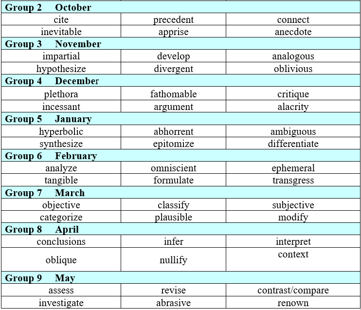

# Tier 2 Vocabulary Project

**Your Task:** Working with your neighbor, create a website that lets students & teachers search for different synonyms / rhymes / etc for Amphi's Academic Vocabulary

## Part 1

Close out of any files we were working on previously. In your Cloud9 environment, `cd` into the `apis-datamus` directory. The terminal should look something like this:

`vocstartsoft:~/environment/apis-datamuse (master) $`

Then use this command to copy down the new files Schneider has made

`git stash`
`git pull`

Re-open `datamuse.html` and `datamuse.js` and verify they've been updated

## Part 2

Update the javascript and HTML so your website can do the following:

For each of the 6 words in your month:

- [ ] There is a button that, when you click it, generates the top 15 words that are similar to the given word
- [ ] There is a button that, when you click it, generates the top 10 words that rhyme with the given word

In addition to the given 6 words, you should also have...

- [ ] A button that, when you click it, prompts the user for a word and displays similar words
- [ ] A button that, when you click it, prompts the user for a word and displays rhyming words

## Part 3

Update the CSS & the HTML so the website looks presentable & usable. Schneider wants to send this to the English teachers over the weekend
